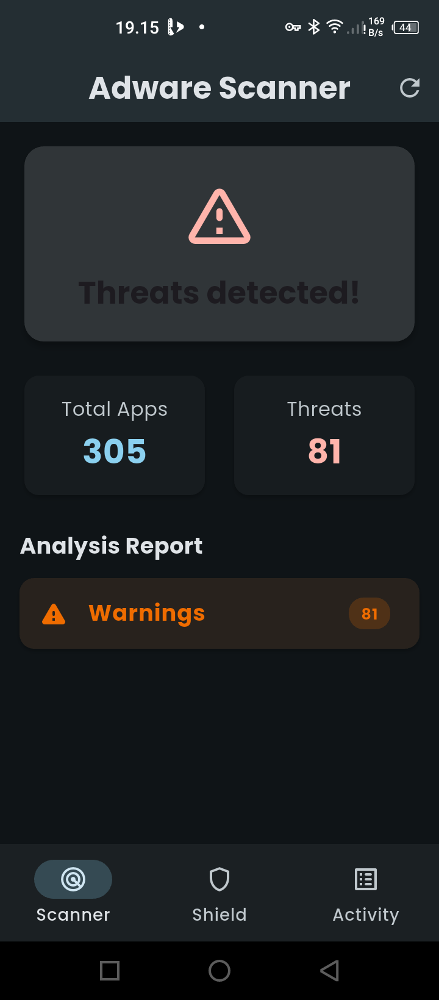
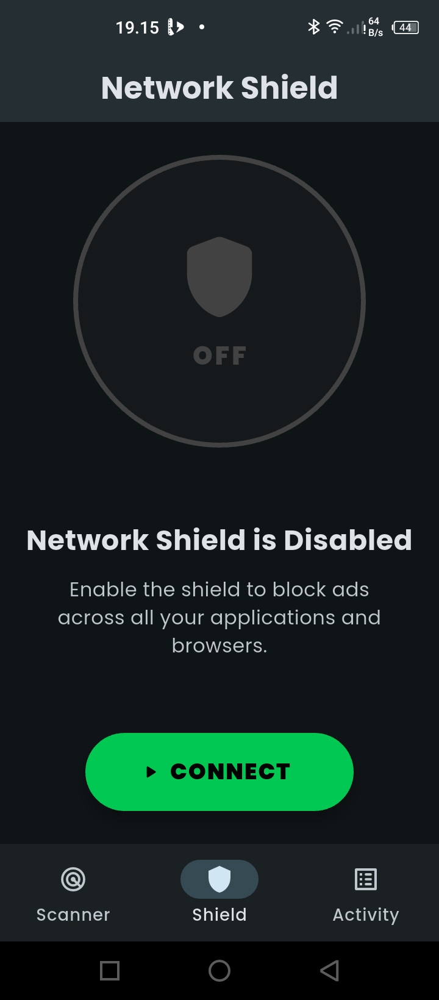
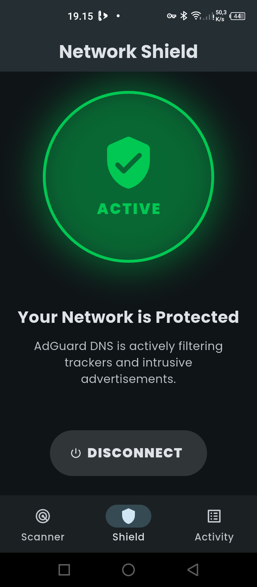
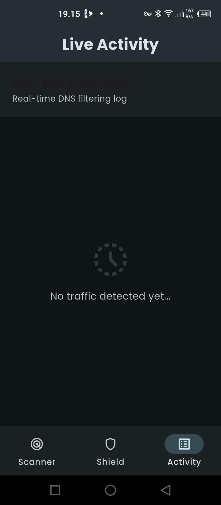
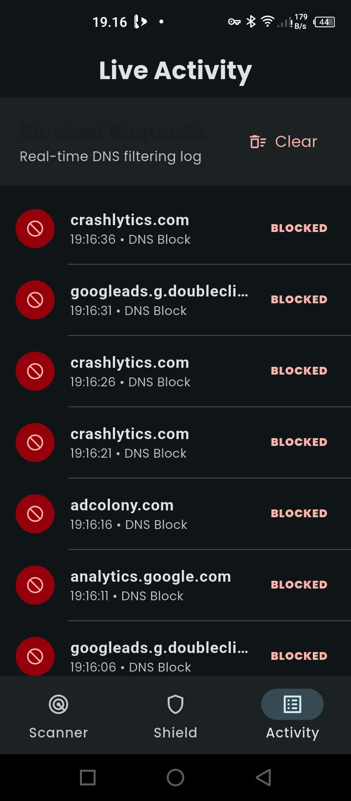

<div align="center">


# ZeroAd

**Android Adware Detection & DNS-Based Ad Blocking**

<p align="center">
<b>ZeroAd</b> adalah aplikasi keamanan Android yang berfokus pada deteksi adware dan pemblokiran iklan berbasis DNS. Dibangun dengan arsitektur ringan dan pendekatan non-invasif, ZeroAd bekerja sepenuhnya tanpa akses root dan mematuhi batasan keamanan sistem Android.
</p>

[Laporkan Bug](https://github.com/initHD3v/ZeroAd/issues) · [Ajukan Fitur](https://github.com/initHD3v/ZeroAd/issues)

</div>

---

## ✨ Fitur Utama

ZeroAd dirancang untuk memberikan perlindungan praktis terhadap adware dan iklan invasif melalui antarmuka navigasi tiga arah yang intuitif.

### 🛡️ Adware Detection Engine (Scanner)
Mesin deteksi adware berbasis heuristik dan signature yang menganalisis aplikasi terinstal secara lokal.
*   **Analisis Heuristik** – Mengidentifikasi pola perilaku mencurigakan seperti penyalahgunaan overlay dan izin tidak relevan.
*   **Signature Detection** – Mendeteksi SDK iklan umum (misalnya AdMob, Unity Ads, IronSource) berdasarkan fingerprint library.
*   **Risk Classification** – Kategorisasi otomatis: **Critical**, **Warning**, atau **Low**.

### ⚡ Network Shield (DNS Filtering)
Perlindungan aktif berbasis jaringan menggunakan layanan VPN lokal Android.
*   **System-wide DNS Filtering** – Memblokir resolusi domain iklan pada tingkat sistem.
*   **AdGuard DNS Integration** – Menggunakan resolver DNS publik AdGuard (`94.140.14.14`) yang stabil.
*   **Battery Efficient** – Berjalan sebagai proxy DNS tanpa pemrosesan paket data yang berat.

### 📋 Live Activity Log
Tab khusus untuk memantau aktivitas jaringan secara real-time.
*   **Real-time Monitoring** – Lihat domain iklan apa saja yang baru saja diblokir oleh sistem.
*   **History Management** – Riwayat aktivitas hingga 100 entri terakhir dengan fitur **Clear Logs**.
*   **Detail Visual** – Menampilkan nama domain, timestamp, dan label status pemblokiran.

---

## ⚙️ Cara Kerja Secara Detail

ZeroAd menggabungkan dua mekanisme pertahanan utama: **Analisis Statis & Heuristik** untuk aplikasi terinstal, dan **Penyaringan Jaringan Dinamis** untuk lalu lintas internet.

### 1. Mekanisme Pemindaian Adware (Deep Scan)
Pemindaian dilakukan secara asinkron menggunakan **Kotlin Coroutines** agar tidak mengganggu performa UI. 
*   **Fase Iterasi Paket:** Mengambil daftar paket terinstal melalui API `PackageManager`.
*   **Analisis Kontekstual:** Menilai risiko berdasarkan korelasi izin. Misalnya, aplikasi kalkulator yang meminta izin `BIND_ACCESSIBILITY_SERVICE` akan mendapatkan skor penalti tinggi.
*   **Kalkulasi ZeroScore:** Memberikan skor numerik internal untuk menentukan tingkat keparahan ancaman sebelum ditampilkan ke pengguna.

### 2. Mekanisme Network Shield (VPN/DNS Interception)
*   **Pembuatan Interface TUN:** Menggunakan `VpnService` Android untuk membuat jalur virtual lokal.
*   **DNS Hijacking (Non-Invasif):** Sistem hanya mencegat paket DNS (Port 53). ZeroAd tidak melakukan inspeksi terhadap isi data Anda (password, chat, dll).
*   **Blocking at Resolution Level:** Permintaan ke domain iklan dikembalikan sebagai alamat `0.0.0.0` (null), sehingga iklan tidak pernah dimuat.

---

## 📸 Antarmuka Aplikasi

<div align="center">
  <table style="width:100%">
    <tr>
      <td align="center"><b>Scanner</b></td>
      <td align="center"><b>Shield</b></td>
      <td align="center"><b>Activity</b></td>
    </tr>
    <tr>
      <td></td>
      <td></td>
      <td></td>
    </tr>
    <tr>
      <td align="center"><b>Risk Groups</b></td>
      <td align="center"><b>Threat Details</b></td>
      <td></td>
    </tr>
    <tr>
      <td></td>
      <td></td>
      <td></td>
    </tr>
  </table>
</div>

---

## 🛠️ Teknologi

ZeroAd menggunakan arsitektur hibrida untuk menyeimbangkan performa dan akses sistem yang mendalam.

| Layer | Teknologi | Keterangan |
| :--- | : :--- | :--- |
| **UI** | Flutter (Dart) | Navigasi 3-tab, Material 3, Google Fonts (Poppins) |
| **Core** | Kotlin (Android Native) | Package analysis, VpnService, Coroutines |
| **Build System** | Gradle (Groovy) | Konfigurasi yang kompatibel dengan Android 15 |
| **Bridge** | MethodChannel | Komunikasi dua arah Flutter ↔ Native |
| **Storage** | SharedPreferences | Penyimpanan status AdBlock & Whitelist |

---

## 🚀 Memulai

### Prasyarat
*   Flutter SDK 3.0+
*   Android SDK (Target API 35)
*   Perangkat Android fisik (disarankan untuk pengujian VPN)

### Instalasi
1.  **Clone repositori**
    ```bash
    git clone https://github.com/initHD3v/ZeroAd.git
    cd ZeroAd
    ```
2.  **Instal dependensi**
    ```bash
    flutter pub get
    ```
3.  **Jalankan aplikasi**
    ```bash
    flutter run
    ```

---

## 🔐 Keamanan & Privasi
*   **Zero Logs:** Tidak ada data riwayat browsing yang dikirim ke server luar.
*   **Lokal:** Semua analisis keamanan aplikasi dilakukan secara lokal di perangkat.
*   **Privasi Maksimal:** ZeroAd tidak menyertakan modul analytics atau pelacak pihak ketiga.

---

## 🤝 Kontribusi
Kontribusi selalu terbuka untuk pengembangan mesin heuristik yang lebih akurat.
1.  Fork repositori ini.
2.  Buat branch fitur (`feature/nama-fitur`).
3.  Ajukan Pull Request.

---

## 📝 Lisensi
Proyek ini dirilis di bawah Lisensi MIT. Lihat file `LICENSE` untuk detail lengkap.

---

<div align="center">
Dikembangkan dengan fokus pada efisiensi dan kejelasan oleh <a href="https://github.com/initHD3v">initHD3v</a>
</div>
